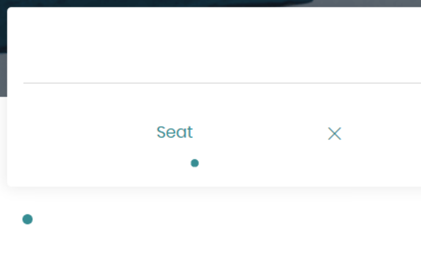
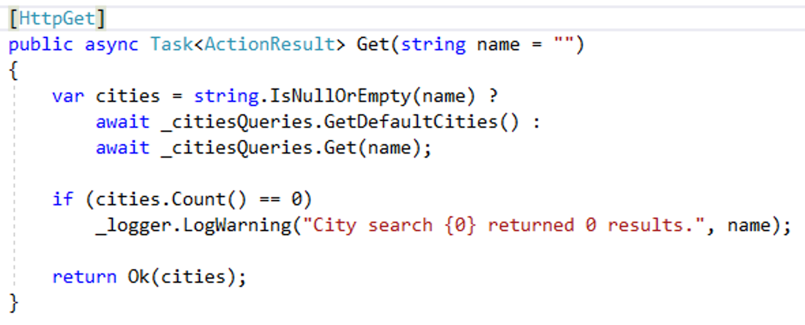

[Azure Dev Spaces](https://docs.microsoft.com/en-us/azure/dev-spaces/azure-dev-spaces) provides a rapid, iterative Kubernetes development experience for teams. With minimal dev machine setup, you can iteratively run and debug containers directly in Azure Kubernetes Service (AKS). Develop on Windows, Mac, or Linux using familiar tools like Visual Studio, Visual Studio Code, or the command line. The diagram below shows how the Visual Studio family of IDEs can connect to AKS to enable debugging within developers' Azure Dev Spaces without impacting production or teammate code.


The AKS cluster created for this lab contains support for Azure Dev Spaces, so that you can debug the individual services live in the Kubernetes cluster. There's a pre-wired error in the Hotels microservice you'll fix during the lab, then debug in your own dev space to validate that the fix worked.

### Lab scenario

You are a new developer working for SmartHotel360, a hotel company. The company's website runs in a huge AKS cluster with a variety of microservices written in Node.js. .NET Core, and Java.

The website provides functionality to search for hotels in a particular city. This functionality works for a few cities, but most cities aren't showing up. You've been assigned a bug to fix this functionality.

### Repro the bug

1. Open the SmartHotel360 web site in a browser. The URL to this site will be provided to you by a lab proctor. It should be in the format `http://myapp.<guid>.eastus.aksapp.io`.

1. Search for **New** (note the capitalization) using the city search feature on the public web site. This should return some results:

    

1. Now search for **Sea** or **Seattle**. Note that no results are found, even though we have hotels in Seattle.

    

### Open the Hotels microservice code
One of your teammates gave you a tip that the code that runs the city search feature is in the CitiesController class of the Hotels microservice. You'll clone your team's GitHub repository in order to find this code.

1. Open Visual Studio.

1. From the **Team** menu, click **Manage connections...**

1. Under **Local Git Repositories**, click **Clone**.

1. In the highlighted yellow box, enter the following URL: `https://github.com/Microsoft/SmartHotel360-AKS-DevSpaces-Demo`

    

1. Click **Solutions and Folders**.

1. Click on the `SmartHotel.Services.Hotels.sln` solution.

### Set up debugging in Azure Dev Spaces

You can see that SmartHotel360 is a large application. In order to track down this bug, you might think you'd need to set up all the databases, services, all of it, or at least get a copy of the AKS cluster on your machine or somewhere else so you won't impact your teammates, who might need to utilize the same databases and services for their own testing. This could take hours, or days, to set up and get working properly.

Luckily, that's exactly what **Azure Dev Spaces** can do for you. Without setting up anything, you can select Dev Spaces to use when you want to debug your code. Then, a copy of your service is deployed into AKS, and commands will be routed to that copy of the service. That way, you can debug my code changes **in your own space** without impacting your teammates, all of whom may have code running in their own Dev Spaces.

1. In Solution Explorer, locate the **SmartHotel.Services.Hotels** project.

1. Expand the **Controllers** folder and double click on **CitiesController.cs.**

    

1. In the `Get` method, add a breakpoint on the curly bracket `{` at the start of the Get method. 

    

1. Right-click the `SmartHotel.Services.Hotels` Visual Studio project. 

    

1. Select **Properties** from the flyout menu. 

1. Select **Debug** in the left navigation. 

1. Select **Azure Dev Spaces** from the Profile menu. This specifies that you want to use Azure Dev Spaces as your debugging target.

    

### Create your own dev space in Azure Dev Spaces
By default, your code will run in your team's dev space when you press F5, but you can easily create your own dev space. This way, you can hammer on the Hotels microservice's code without affecting your teammates, who will still work against the version of Hotels running in the team's dev space.

1. Click the **Change** button. 

1. Click on **Add an Account** and sign in to Azure using the credentials provided by a lab proctor.

1. Select the AKS Cluster you want to use. Please check with a lab proctor to identify which cluster to use.

1. Select **Create New Space** from the Space menu. 

    

1. Give your space a name. Use something that will be unique to you, such as your first name or Microsoft alias.
    
    

1. Click OK.

1. Back in the debug properties window, enable the **Launch browser** checkbox.

1. Paste in the URL of the site (this should be the web site's public URL running in your cluster).

1. Prefix the URL with the name of the space and `.s.` so that the format is `http://{yourspace}.s.{original URL}`. By doing this, all the HTTP calls to the Hotels REST API will be routed to the container running in your own personal dev space.

    

### Run your code in Azure Dev Spaces

1. Select **Azure Dev Spaces** from the debug menu. 

    

1. Hit F5 to start the debugger (or click the toolbar button in Visual Studio). 
    
    This first F5 will take some time. The app will be compiled, then built into a Docker image. That image will then be published up into AKS and initialized in a namespace named with your dev space name. Then, the browser will open to the public web site. The URL of the site will include a prefix, however, that will be passed through when REST API calls are made to the Hotels API. Since that prefix is coming through on the URL, Dev Spaces knows that means to route traffic to the Hotels container running in your personal dev space, where you've got the debugger attached.

1. Once the site opens, scroll down and search for **Seattle** in the city search box. 

    

1. In a moment, Visual Studio should obtain focus and the debugger should stop on the line with the breakpoint.

### Fix the Hotels microservice

1. Use the F10 key to step through the code for the `Get` method to see if you can tell what's wrong. You'll see that the `cities.Count() == 0` condition is hit, even though we expect `Seattle` to be in the list of cities.

1. There must be something wrong with the previous line, where there are two calls to the `GetDefaultCities` method. Stop debugging by pressing **Shift-F5**, then take a closer look at this code.

1. You can right click on the method name and then click **Go to Definition** to see what that method is doing.

    

1. Looks like the `GetDefaultCities` method returns a static list. The list doesn't contain Seattle, so that explains why it isn't showing up.

    

1. Scroll up to show the `Get` method. You can see that this is the one that actually uses Entity Framework to query the database. 
    

1. Find the line of code in `CitiesController` using the `Where` method:

    ```csharp
    _citiesQueries.GetDefaultCities().Result
        .Where(city => city.Name.StartsWith(name));
    ```

1. Change the code to match this:

    ```csharp
    await _citiesQueries.Get(name);
    ```

    

1. Press **Ctrl-S** to save your changes.

### Validate your fix

1. Press F5 to start debugging again.

1. When the debugger stops again, step through the code to see that the search hit the database and found a result for "Seattle."
    
    

1. Hit F5 again to let the code continue running. 
    
    

1. Go to the public URL for the team's version of the website, by removing the `<spacename>.s.` prefix from the URL. \(Or, ask your neighbor to do so.\) Then try searching for **Seattle**.

    Note that this time, the debugger does *not* break in when you search for a city name. That is because the team's version of the website hits the version of the Hotels microservice that is running in the team's dev space, while your debugger is hooked up to the version of the Hotels microservice that is running in your personal dev space.

    Also note that the bug still exists in the team's version of the website. At this point, you would need to follow the team's procedures to check in your fix to source control and deploy the updated code to the team's dev space.

Now, the search is working. In just minutes, you were able to find and fix the bug, as well as validate your fix.  

You see can see that with Azure Kubernetes Service, developers will get the best end-to-end experience in the industry for building apps in containers using Kubernetes. When issues arise, you’ll use the integrated Azure Dev Spaces in Visual Studio and VS Code to build and debug your applications in your own dev spaces,without messing with your teammates' code, and without having to spend days getting up and running.