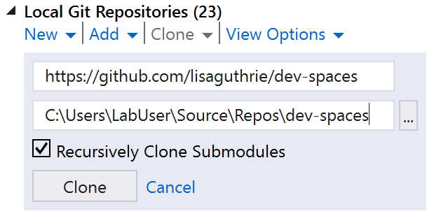
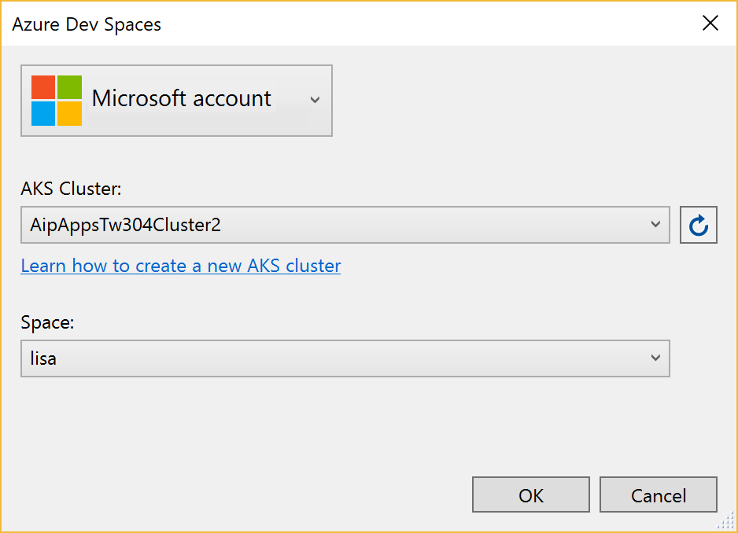

[Azure Dev Spaces](https://docs.microsoft.com/en-us/azure/dev-spaces/azure-dev-spaces) provides a rapid, iterative Kubernetes development experience for teams. With minimal dev machine setup, you can iteratively run and debug containers directly in Azure Kubernetes Service (AKS). Develop on Windows, Mac, or Linux using familiar tools like Visual Studio, Visual Studio Code, or the command line.

In this lab, you will work with a simple web application that consists of a front-end website and a back-end web API, running inside an AKS cluster. You will make some quick updates to these services. The AKS cluster created for this lab contains support for Azure Dev Spaces, so that you can debug the individual services live in the cluster.

### Open the web application code
1. Open Visual Studio.

1. From the **Team** menu, click **Manage connections...**

1. Under **Local Git Repositories**, click **Clone**.

1. In the highlighted yellow box, enter the following URL: `https://github.com/lisaguthrie/dev-spaces`

    

1. Click **Solutions and Folders** and then click **webfrontend.sln** to open the solution file.

### Set a breakpoint inside the front-end website

1. In Solution Explorer, expand the **Controllers** folder and double click on **HomeController.cs**.

1. Set a breakpoint on the first line of the `About()` method.

    

### Set up debugging in Azure Dev Spaces

1. Click on the arrow to the right of the the debug launch target button, and then click **Azure Dev Spaces**.

    

1. Click on **Add an Account** and sign in to Azure using the credentials found under the **Resources** tab, just above where you are reading these lab directions.

1. Select the AKS Cluster you want to use. Please check with a lab proctor to identify which cluster to use.

1. Select **Create New Space** from the Space menu. 

    

1. Give your space a name. **Because your cluster is shared with other lab participants, please use something that will be unique to you**, such as your first name or Microsoft alias.
    
    

1. Click OK to create your space.

1. Click OK.

    

### Run your code in Azure Dev Spaces

1. Hit F5 to start the debugger (or click the toolbar button in Visual Studio). 
    
    >This first F5 will take some time. The app will be compiled, then built into a Docker image. That image will then be published up into AKS and initialized in a namespace named with your dev space name. Then, the browser will open to the public web site.

1. Once the site opens, click on the About button in the navigation menu at the top of the page.

1. In a moment, Visual Studio should obtain focus and the debugger should stop on the line with the breakpoint. From here, you can use the debugger to step through your code, inspect variable values, etc., just as if your code were running locally.

1. When you are ready, press Shift-F5 to stop debugging.

### Call mywebapi from webfrontend
Next, you will update your `webfrontend` code to call into a back-end Node.js microservice called `mywebapi`. This web API is not exposed publicly to the Internet, but it is available inside the AKS cluster at `http://mywebapi.`

Traditionally, you would need to run `mywebapi` on your local dev workstation (which could be time-consuming to set up and configure), or mock the interface used between `webfrontend` and `mywebapi` (which could result in integration problems if your mock is not in sync with the real version of `mywebapi`). But with Azure Dev Spaces, `mywebapi` is already running in your team's cluster. You simply need to update your `webfrontend` code to call into it.

1. In Visual Studio, open the `HomeController.cs` file again.

1. Replace the `About()` method with the following code:

```csharp
    public async Task<IActionResult> About()
    {
        using (var client = new System.Net.Http.HttpClient())
        {
            // Call *mywebapi*, and display its response in the page
            var request = new System.Net.Http.HttpRequestMessage();
            request.RequestUri = new Uri("http://mywebapi/");
            if (this.Request.Headers.ContainsKey("azds-route-as"))
            {
                // Propagate the dev space routing header
                request.Headers.Add("azds-route-as", this.Request.Headers["azds-route-as"] as IEnumerable<string>);
            }
            var response = await client.SendAsync(request);
            ViewData["Message"] = await response.Content.ReadAsStringAsync();
        }
    return View();
    }
```

>This code propagates a special header called `azds-route-as`. When a request comes in to a Dev Spaces enabled cluster, Dev Spaces automatically populates this header with the name of the space specified in the public URL. When you call into another microservice, Dev Spaces looks at the value of this header. If a version of that microservice is running inside the dev space specified in the `azds-route-as` header, Dev Spaces automatically routes that call to that version of the microservice. If it's not running there, then Dev Spaces will route the call to the version of the microservice running in the parent space -- `default`, in this example.

1. Press F5 to debug `webfrontend` again.

1. When the page loads, click on the **About** button again.

1. This time, you should see the data returned from `mywebapi`, instead of the generic "Your application description here" message.

You see can see that with Azure Kubernetes Service, developers will get the best end-to-end experience in the industry for building apps in containers using Kubernetes. You can use the integrated Azure Dev Spaces in Visual Studio and VS Code to build and debug your applications in your own dev spaces, without messing with your teammates' code, and without having to spend days getting up and running.